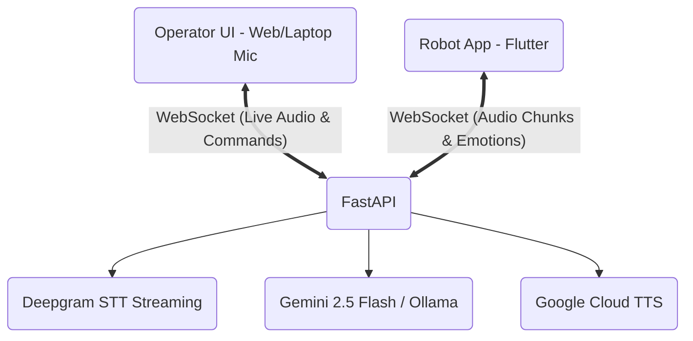

# S-SOCRATES 🤖

**S-SOCRATES** là hệ thống Robot AI hội thoại tiếng Việt theo kịch bản "Talkshow / Phản biện", được nhúng công nghệ **Dual-Streaming (STT/TTS Real-time)** độ trễ siêu thấp.

Dự án bao gồm 3 thành phần chính:
- **Operator Console (Web UI)**: Tổng đài theo dõi và điều phối AI, duyệt câu trả lời, can thiệp cảm xúc Robot.
- **Robot App (Flutter)**: Ứng dụng chạy trên thiết bị vật lý (Robot/Tablet) hiển thị giao diện 3D Orb cảm xúc và phát/thu âm.
- **FastAPI Backend**: Xử lý logic AI (Gemini/Ollama), quản lý kết nối WebSocket, STT (Deepgram) và TTS (Google Cloud).

---

## 🔥 Tính năng cốt lõi (Mới cập nhật)
- ⚡ **Dual-Streaming WebSockets**: Giao tiếp 2 chiều Full-Duplex giữa Operator, Backend và Robot. Dẹp bỏ hoàn toàn độ trễ của cơ chế HTTP Polling cũ.
- ⚡ **Chunked TTS (Sentence-level)**: Chuyển đổi văn bản thành giọng nói và phát (stream) theo từng câu thay vì đợi xử lý toàn bộ đoạn văn. Tốc độ nói của Robot gần như tức thời (Sub-second latency).
- 🎙️ **Live STT (Deepgram)**: Thu âm và bóc băng theo thời gian thực (Interim/Final words) với tốc độ chớp nhoáng.
- 🧠 **Cơ chế 2 AI Engine**: Tự động chuyển đổi giữa **Gemini 2.5 Flash** (hỗ trợ stream siêu nhanh) và **Ollama Qwen2** (để chạy Local Offline).
- 🎭 **Sync Audio & UI Animation**: Đồng bộ hoàn toàn khẩu hình hình ảnh 3D Orb (Speaking, Challenge, No Voice) với từng tệp âm thanh đang phát, không kẹt Subtitle đi trước Audio.

---

## 🏗️ Kiến trúc tổng quan



---

## 📦 Thành phần dự án
- `S-SOCRATES-BE/`: Backend chạy bằng **Python FastAPI**.
- `voice_chat_app/` *(trong S-SOCRATES-APP)*: App dành cho Robot code bằng **Flutter/Dart**.
- `operator-ui/`: Giao diện Web (HTML/CSS/JS thuần).

---

## 🚀 Hướng dẫn cài đặt & Khởi chạy (Quick Start)

Yêu cầu phần mềm: Python `>= 3.10`, Flutter SDK `>= 3.24`. Cần có API Keys của Gemini (AI Studio), Deepgram, và Google Cloud Console. Cấu hình file `.env` ở thư mục `S-SOCRATES-BE/`.

Khởi chạy bằng 3 Terminal riêng biệt:

### 1) Kích hoạt Backend (FastAPI)
```powershell
cd S-SOCRATES-BE
python -m venv .venv
.\.venv\Scripts\activate
pip install -r requirements.txt
uvicorn main:app --reload --port 8000 --host 0.0.0.0
```

### 2) Chạy Ollama (Tùy chọn nếu xài offline)
```powershell
ollama run qwen2:7b
```

### 3) Chạy Robot App (Flutter)
```powershell
cd S-SOCRATES-APP\voice_chat_app
flutter pub get
flutter run -d windows  # Hoặc build APK cài vào máy tính bảng Android
```

---

## 🎧 Operator Console
Thay vì dùng HTTP tĩnh, bạn nên mở Web Operator thông qua server uvicorn đang chạy:
👉 **Truy cập:** [http://localhost:8000/operator/](http://localhost:8000/operator/)
*(Lưu ý: Bắt buộc dùng `localhost` để trình duyệt Chrome bỏ chặn quyền truy cập Microphone cho Laptop).*

**Các tính năng trên giao diện điều phối:**
- **Nguồn Âm Thanh:** Chọn thu âm vào từ Laptop của Đạo diễn hoặc từ Mic của Robot.
- **AI Trực Tiếp:** Bắn thẳng luồng ngữ cảnh cho Gemini trả lời tự động.
- **AI Duyệt Trước:** Tuỳ chọn text, sửa lỗi, và gán Emoji ngữ điệu (Speaking, Challenge) trước khi cho Robot đọc TTS.

---

## 🔒 Bảo mật
- Tuyệt đối **KHÔNG** push file `.env` chứa `GEMINI_API_KEY`, `DEEPGRAM_API_KEY` cũng như file `credentials.json` của Google Cloud lên public Github.
- Dự án sử dụng WebSocket nội bộ không mã hoá, nếu deploy lên server công cộng cần bọc TLS qua Nginx (chuyển sang WSS).
