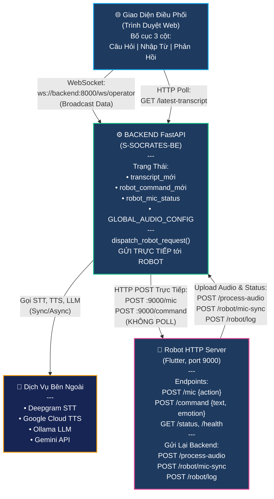

# S-SOCRATES: Hệ Thống AI Phản Biện

## 📋 Tổng Quan Dự Án

**S-SOCRATES** là nền tảng điều phối robot AI tương tác giọng nói cho các buổi phản biện hoặc talkshow. Hệ thống gồm 3 thành phần chính:

1. **Giao Diện Điều Phối** (Web): Giao diện web để quản lý transcript, tạo response, điều khiển mic robot từ xa
2. **Backend** (FastAPI): Xử lý AI, STT, TTS, quản lý trạng thái, **GỬI LỆNH TRỰC TIẾP TỚI ROBOT**
3. **Ứng Dụng Robot** (Flutter HTTP Server): Ghi âm, phát TTS, hiển thị cảm xúc, nhận lệnh từ backend

⚠️ **Điểm Chính**: Ứng Dụng Robot là một **HTTP Server** (port 9000), Backend gửi lệnh trực tiếp qua HTTP POST.

---

## 🏗️ Kiến Trúc Hệ Thống



---

## 📁 Cấu Trúc File

```
S-SOCRATES/
├── README.md
├── operator-ui/
│   ├── index.html
│   ├── style.css
│   ├── script.js
│   └── assets/
│
├── S-SOCRATES-BE/
│   ├── main.py
│   ├── requirements.txt
│   ├── qa_presets.json
│   ├── memory.json
│   ├── knowledge/
│   │   └── uth.txt
│   ├── services/
│   │   ├── stt_service.py
│   │   ├── tts_service.py
│   │   ├── llm_service.py
│   │   └── ...
│   └── utils/
│       └── logger.py
│
└── S-SOCRATES-APP/
    └── voice_chat_app/
        ├── pubspec.yaml
        ├── lib/
        ├── android/
        ├── ios/
        ├── windows/
        └── test/
```

---

## 🚀 Thiết Lập Phát Triển

### Yêu Cầu
- Python 3.10+
- Ollama (cho LLM local)
- Flutter SDK
- API keys (Deepgram, Gemini, Google Cloud TTS)

### Cài Đặt

```powershell
# Terminal 1: Chạy Ollama
ollama pull qwen2:1.5b
ollama serve

# Terminal 2: Backend
cd S-SOCRATES-BE
python -m venv .venv
.\.venv\Scripts\activate
pip install -r requirements.txt

# Tạo .env
# DEEPGRAM_API_KEY=key_của_bạn
# GEMINI_API_KEY=key_của_bạn
# GOOGLE_APPLICATION_CREDENTIALS=/đường/dẫn/google-key.json
# ROBOT_CONTROL_URL=http://192.168.1.6:9000

uvicorn main:app --reload --port 8000 --host 0.0.0.0

# Terminal 3: Giao Diện Điều Phối
# Mở http://localhost:8000/operator trong trình duyệt

# Terminal 4: Ứng Dụng Robot
cd S-SOCRATES-APP/voice_chat_app
flutter pub get
flutter run -d windows  # hoặc chrome, android, etc.
```

### Biến Môi Trường

Tạo `.env` trong `S-SOCRATES-BE/`:
```bash
# STT
DEEPGRAM_API_KEY=<key_của_bạn>

# TTS
GOOGLE_APPLICATION_CREDENTIALS=/đường/dẫn/tuyệt/đối/google-key.json

# LLM Cloud
GEMINI_API_KEY=<key_của_bạn>

# Robot
ROBOT_CONTROL_URL=http://192.168.1.6:9000

# Logging
LOG_LEVEL=INFO
```

---

## 🐛 Khắc Phục Sự Cố

### Backend không khởi động
```bash
# Kiểm tra port 8000
netstat -ano | findstr :8000

# Kiểm tra phiên bản Python (phải 3.10+)
python --version

# Kiểm tra .env tồn tại
type .env
```

---

## 📞 Hỗ Trợ

**Tài Liệu API**:
- Swagger UI: http://localhost:8000/docs
- OpenAPI JSON: http://localhost:8000/openapi.json

**Debug**:
```python
# Trong main.py
import logging
logging.basicConfig(level=logging.DEBUG)
```

**Kiểm Tra Sức Khỏe**:
```bash
curl http://localhost:8000/
curl http://localhost:8000/qa-presets
curl http://localhost:8000/configs
```